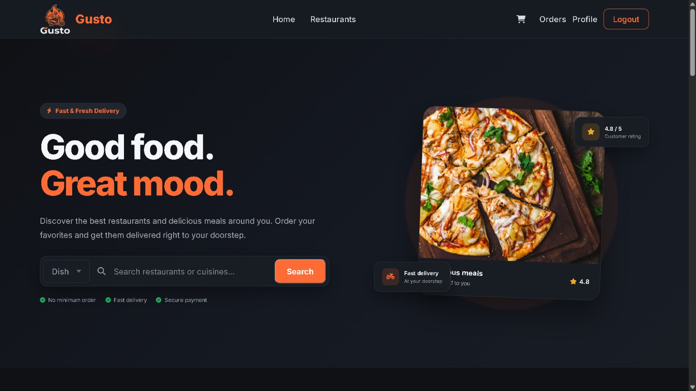
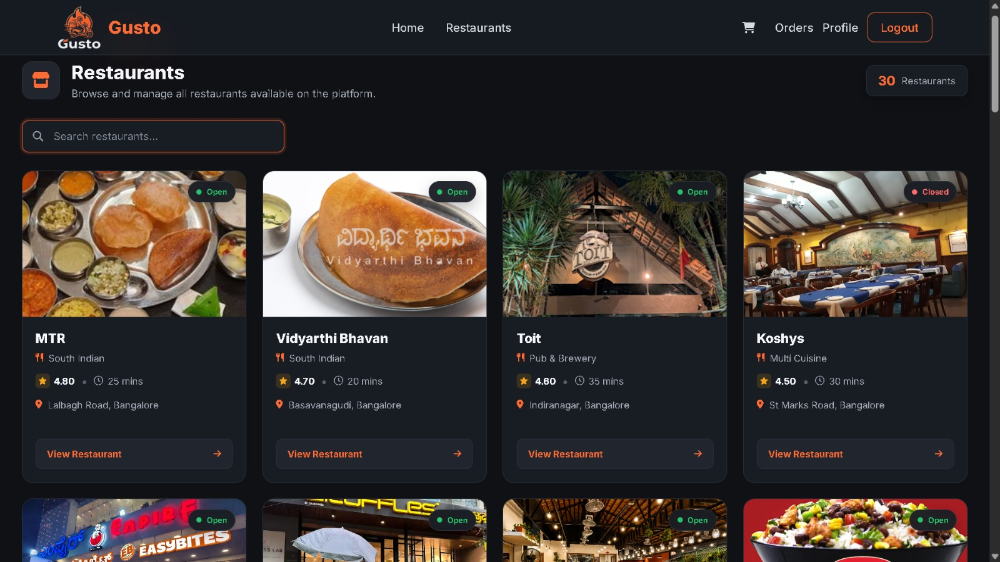
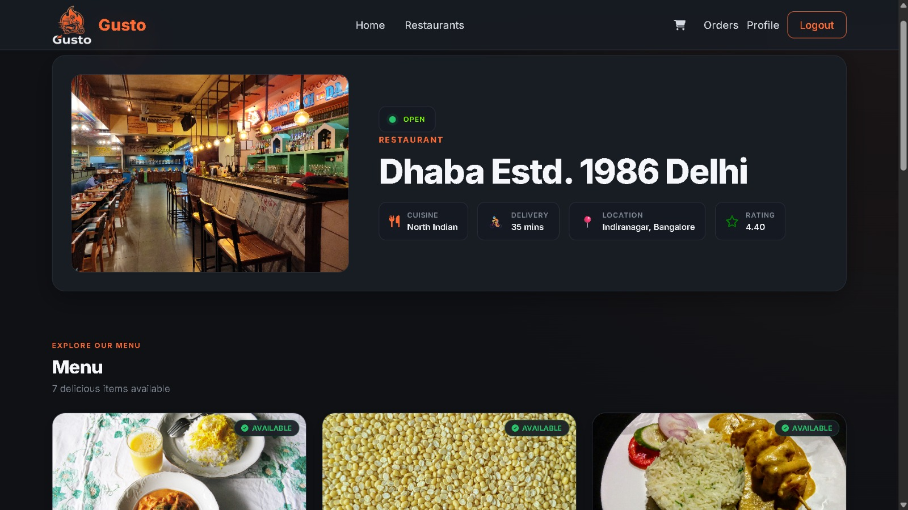
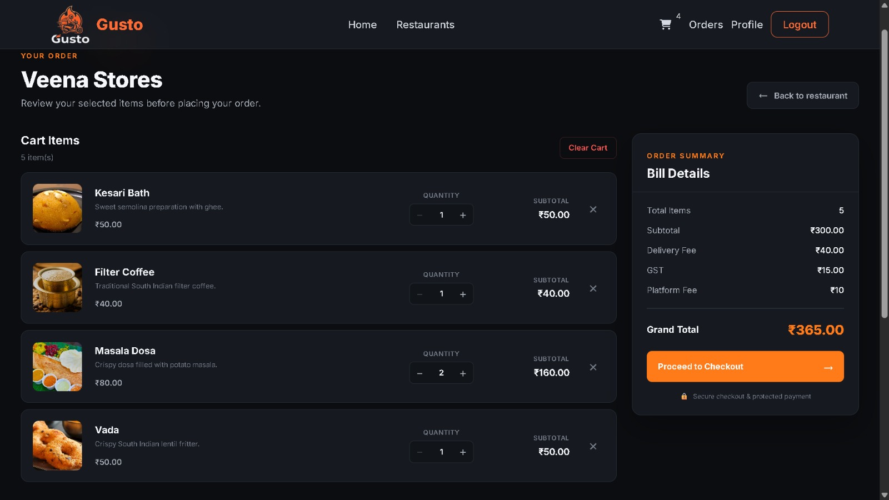
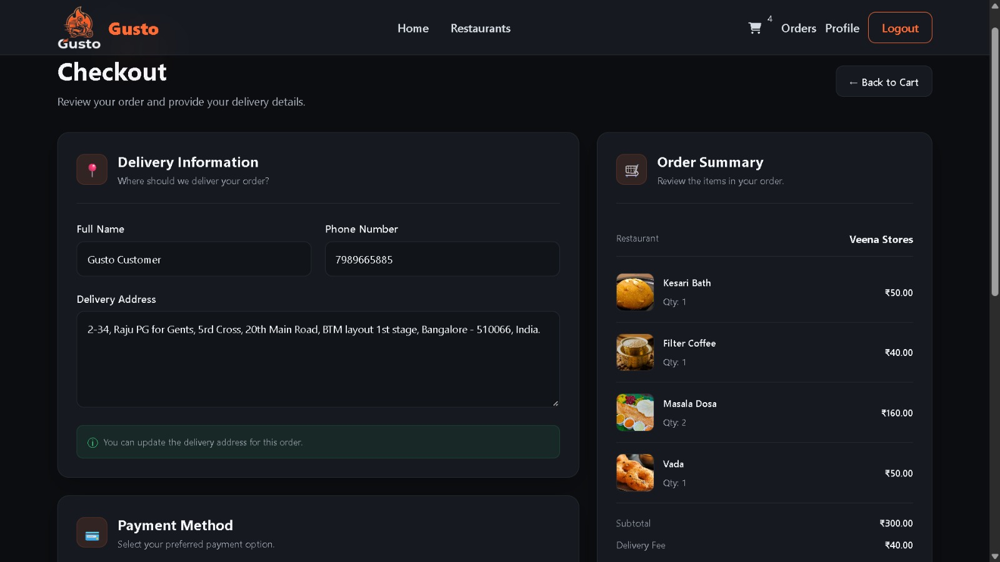
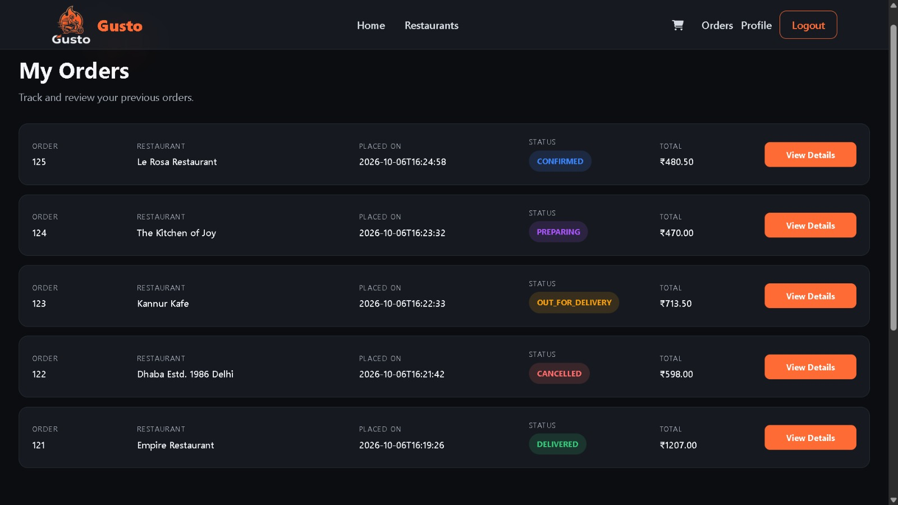

# Gusto: Food Delivery Web App

Gusto is a full-stack food delivery web application built with **Java Servlets, JSP/JSTL, JDBC, HTML, CSS and MySQL**, following the **MVC pattern with a DAO layer**. Customers can browse restaurants, search for dishes, build a cart, and place Cash on Delivery orders.

**Live demo:** https://gusto-rtwl.onrender.com/Gusto/

> The demo runs on free hosting. If it has been idle, the first page load can take up to a minute while the server wakes up.

**Demo login (customer account):**

| Email | Password |
|---|---|
| `gustodemo123@gmail.com` | `GustoDemo@123` |

---

## Screenshots

| Home | Restaurants |
|---|---|
|  |  |

| Restaurant menu | Cart |
|---|---|
|  |  |

| Checkout | My Orders |
|---|---|
|  |  |

---

## Features

**Guests**
- Browse the home page, the restaurant list and each restaurant's menu
- Search restaurants and dishes (SQL `LIKE` queries)
- Build a cart without signing in; the cart is kept in the HTTP session
- Sign up and sign in; checkout requires an account

**Customers**
- Cart with quantity controls, item removal, clear cart, and a bill breakdown (subtotal, delivery fee, GST, platform fee)
- Single-restaurant cart: adding items from a different restaurant asks for confirmation before replacing the cart
- Checkout with a per-order delivery address that does not overwrite the profile address
- Order confirmation page, order history, and order details
- Profile page: update name, phone and address; change password
- Closed restaurants hide the Add to cart button

**Footer pages:** About, Contact, Privacy Policy, Terms & Conditions, Refund Policy and FAQ.

**Current scope:** this version focuses on the guest and customer experience. The database also defines `ADMIN`, `DELIVERY_AGENT` and `SUPER_ADMIN` roles for future work. Payment is **Cash on Delivery only**. Order status starts as `PENDING` and is updated directly in the database.

---

## Backend highlights

- **DAO architecture:** 
  - Implemented a clean multi-layer architecture using DAO, Service, and Servlet layers.
  - Separation of concerns ensures maintainability, scalability, and easier testing.
  - Business logic is isolated from presentation and database access layers.
- **MVC-Based Web Application:** 
  - Followed the Model-View-Controller (MVC) design pattern.
  - JSP handles the presentation layer.
  - Servlets act as controllers for request processing.
  - Model classes represent business entities.
- **Session-Based Authentication:**
  - Secure user authentication using HttpSession.
  - Protected routes accessible only to authenticated users.
  - Persistent login sessions across the application.
  - Secure logout functionality with session invalidation.
- **JDBC transactions:** an order and its items are saved in one transaction (`setAutoCommit(false)`, then commit, or rollback on failure), so a failed order never leaves partial data.
- **Server-side price calculation:** subtotal, GST and platform fee are calculated in Java using item prices read from the database, never from form values.
- **Authorization check:** an order's details are shown only to the customer who owns it; other requests get a forbidden error.
- **Password security:** passwords are stored as BCrypt hashes (jBCrypt).
- **Foreign keys and cascades:** relational schema with `Users`, `Restaurant`, `Menu`, `Orders` and `OrderItem` tables.
- **Configuration through environment variables:** database credentials are read from `DB_URL`, `DB_USER` and `DB_PASSWORD`, with `db.properties` as a local fallback, so no secrets are stored in the repo.
- **Order Processing Workflow:**
  - Complete order placement workflow.
  - Stores order information and associated order items.
  - Maintains transactional consistency during order creation.
  - Automatic cart cleanup after successful order placement.
- **Advanced Cart Management:**
  - Restaurant-specific cart validation.
  - Prevents ordering from multiple restaurants simultaneously.
  - Restaurant-switch confirmation workflow.
- **Dynamic Search Functionality:**
  - Search restaurants by name.
  - Search menu items across restaurants.
  - Optimized retrieval of search results with restaurant context.

---

## Tech stack

| Layer | Technology |
|---|---|
| Language | Java 17 |
| Frontend | HTML5, CSS3 (rendered through JSP views) |
| Web | Servlets (javax.servlet 4.0), JSP, JSTL 1.2 |
| Data | JDBC, MySQL 8 (mysql-connector-j 8.4) |
| Security | jBCrypt |
| Build | Maven (WAR packaging) |
| Server | Apache Tomcat 9 |
| Deployment | Docker, Render (app), Aiven (cloud MySQL), GitHub |

---

## Database

Five tables: `Users`, `Restaurant`, `Menu`, `Orders`, `OrderItem`. The schema is in [`database/schema.sql`](database/schema.sql).

---

## Run it locally

**Requirements:** JDK 17+, Maven, MySQL 8, Apache Tomcat 9.

1. Clone the repo:
   ```bash
   git clone https://github.com/BharathBanti/Gusto.git
   cd Gusto
   ```
2. Create the database and tables:
   ```sql
   CREATE DATABASE food_delivery_app;
   USE food_delivery_app;
   -- then run database/schema.sql
   ```
   Add your own restaurants and menu items to the `Restaurant` and `Menu` tables.
3. Create `src/main/resources/db.properties` (this file is git-ignored):
   ```properties
   db.driver=com.mysql.cj.jdbc.Driver
   db.url=jdbc:mysql://localhost:3306/food_delivery_app?useSSL=false&allowPublicKeyRetrieval=true&serverTimezone=Asia/Kolkata
   db.user=root
   db.password=your_password
   ```
   Or set the environment variables `DB_URL`, `DB_USER` and `DB_PASSWORD`, which take priority.
4. Build the WAR file:
   ```bash
   mvn clean package
   ```
5. Copy `target/Gusto.war` into Tomcat's `webapps` folder, start Tomcat, and open http://localhost:8080/Gusto/

---

## Deployment

The app is deployed with a multi-stage `Dockerfile`: Maven builds the WAR, and a Tomcat 9 image runs it. The Render web service reads database settings from environment variables (`DB_URL`, `DB_USER`, `DB_PASSWORD`, `PORT`), and the database is a managed MySQL service on Aiven.

---

## Author

**Dasari Bharath**
[GitHub](https://github.com/BharathBanti) · [LinkedIn](https://www.linkedin.com/in/dasari-bharath)